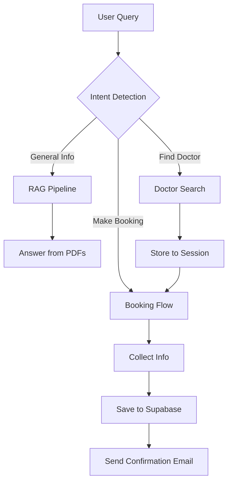

# AI Booking Assistant 🤖

An intelligent, RAG-powered booking system designed for medical practices and service providers. This application leverages cutting-edge AI to provide instant information from uploaded documents and facilitates a seamless, conversational booking experience.

## 🚀 Workflow Overview



1.  **Intent Detection**: The system analyzes user input to determine if they are asking a question, searching for a provider, or ready to book.
2.  **RAG (Retrieval-Augmented Generation)**: Answers questions based on the content of uploaded PDF documents.
3.  **Doctor Suggestions**: Specifically extracts doctor details from documents and stores them in the session for immediate booking use.
4.  **Booking Flow**: A guided multi-turn conversation that collects required details and validates them.
5.  **Data Persistence**: Confirmed bookings and customer details are stored in **Supabase**.
6.  **Email Integration**: A separate Node.js service sends a confirmation email.

## 🧠 Models Used

| Component | Model | Provider |
| :--- | :--- | :--- |
| **Large Language Model (LLM)** | `gemini-3-flash-preview` | Google AI Studio |
| **Embeddings** | `models/gemini-embedding-001` | Google AI Studio |
| **Vector Database** | `FAISS` | Facebook Research |


## 📸 Demo Screenshots

> [!NOTE]
> Add your screenshots here to showcase the app!

### Main Interface

*Description: The main chat interface with the premium sidebar navigation.*

### Conversational Booking

*Description: Demonstrating the multi-turn conversation used to collect booking details.*

### Admin Dashboard

*Description: The secure dashboard where admins can view all appointments.*

## 🛠️ User Manual: Setup Guide

### 1. Database Setup (Supabase)
Run the following SQL command in your Supabase SQL Editor to create the necessary tables:

```sql
-- Create customers table
CREATE TABLE IF NOT EXISTS customers (
    customer_id SERIAL PRIMARY KEY,
    name TEXT NOT NULL,
    email TEXT UNIQUE NOT NULL,
    phone TEXT
);

-- Create bookings table
CREATE TABLE IF NOT EXISTS bookings (
    id SERIAL PRIMARY KEY,
    customer_id INTEGER REFERENCES customers(customer_id),
    booking_type TEXT,
    date DATE,
    time TEXT,
    status TEXT DEFAULT 'confirmed',
    created_at TIMESTAMP WITH TIME ZONE DEFAULT CURRENT_TIMESTAMP,
    doctor_name TEXT DEFAULT 'Dr. Vikram Rao'
);

-- Create users table for authentication
CREATE TABLE IF NOT EXISTS users (
    email TEXT PRIMARY KEY,
    password TEXT NOT NULL,
    is_admin BOOLEAN DEFAULT FALSE
);

-- Insert default admin user if it doesn't exist
INSERT INTO users (email, password, is_admin)
VALUES ('admin@example.com', 'admin123', TRUE)
ON CONFLICT (email) DO NOTHING;
```

### 2. Environment Configuration
Create a `.env` file in the `AI_UseCase` root directory:

```env
GEMINI_API_KEY=your_key_here
SUPABASE_URL=your_project_url
SUPABASE_ANON_KEY=your_anon_key
EMAIL_SERVICE_URL=https://ai-booking-email-sender.vercel.app/booking-confirmation
```

### 3. Local Installation
```bash
# Clone the repository and enter the directory
cd AI_UseCase

# Create and activate virtual environment
python -m venv venv
.\venv\Scripts\Activate.ps1  # On Windows

# Install dependencies
pip install -r requirements.txt

# Run the application
streamlit run app.py
```

### 4. Deployment
This app is ready for deployment on **Streamlit Cloud**. Ensure all environment variables are added to your hosting provider's dashboard.


Created BY:
🧑‍🦱Name:- Aditya Chandra
📩Contact :- adityachandra419@gmail.com
